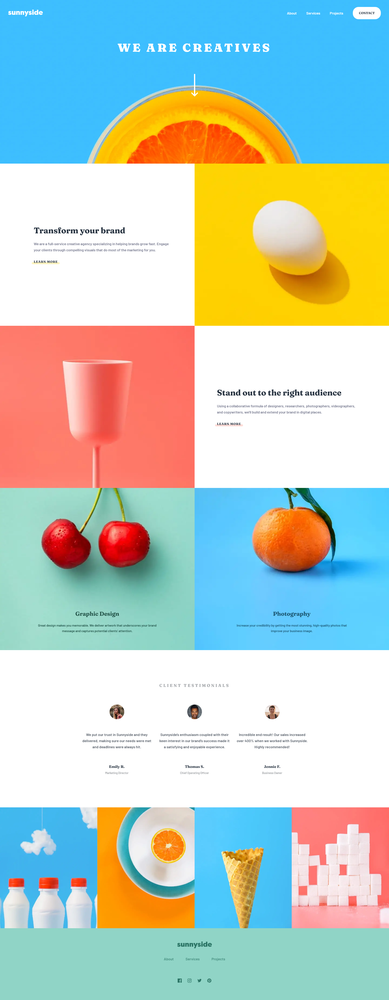

# Sunnyside agency landing page solution

## Table of contents

- [Overview](#overview)
    - [The challenge](#the-challenge)
    - [Screenshot](#screenshot)
    - [Links](#links)
- [My process](#my-process)
    - [Built with](#built-with)
- [Author](#author)

## Overview

### The challenge

Users should be able to:

- View the optimal layout for the site depending on their device's screen size
- See hover states for all interactive elements on the page

### Screenshot

### Links

- [Solution URL](https://github.com/andreialisenok/sunnyside_agency/settings/pages)
- [Live Site URL](https://sunnyside-agency-seven.vercel.app/)

## My process

### Built with

- HTML5
- CSS3
- Vanilla Javascript

## Author

- [GitHub](https://github.com/andreialisenok)
- [Vercel](https://vercel.com/andreialisenok)
- [Frontend Mentor](https://www.frontendmentor.io/profile/andreialisenok)

